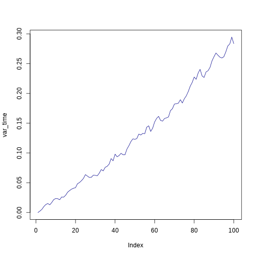

% Vectorisation et tests
% Timothée Poisot
%

# Dans l'épisode précédent

1. Comment écrire une fonction
2. L'importance de bien penser à son algorithme

# Solution de l'exercice

On génére N points positionnés *au hasard* dans le rectangle ou les deux cercles sont inscrits

On compte combien de points sont dans au moins un cercle (U) et combien sont dans les deux (D)

L'aire relative de la surface ou les cercles se recouvrent est U/D

Version R: `advanced/seance1_cercles.r`

# Programme de la séance

1. Les tests
2. La vectorisation
3. Dynamiques écologiques neutres

# Les tests

Principe général: **si** une condition, **alors** une instruction (**sinon**, autre chose)

Par exemple

```{}
pour tous les nombres i entre et 10
   si i est pair
      afficher i
   sinon
      afficher i + 1
```

# Les tests


```r

pair = function(x) (x%%2) == 0

for (i in c(1:10)) {
    if (pair(i)) {
        print(i)
    } else {
        print(i + 1)
    }
}
```

```
## [1] 2
## [1] 2
## [1] 4
## [1] 4
## [1] 6
## [1] 6
## [1] 8
## [1] 8
## [1] 10
## [1] 10
```


# Pour faire court en R


```r
a = 2
b = ifelse(a < 3, 0, 1)
b
```

```
## [1] 0
```


# Le type booléen

Prend deux valeurs: `vrai` et `faux`

Dans R: `TRUE`, `FALSE`, `T`, `F`, *mais aussi* `1`, `0`  

Par exemple:


```r
a = 2
a == 2
```

```
## [1] TRUE
```

```r
a + 3 > 3
```

```
## [1] TRUE
```

```r
(a + 1 > 3) + 1
```

```
## [1] 1
```


# Comparaisons: *et* logique


```r
TRUE & TRUE
```

```
## [1] TRUE
```

```r
TRUE & FALSE
```

```
## [1] FALSE
```

```r
FALSE & FALSE
```

```
## [1] FALSE
```


# Comparaisons: *ou* logique


```r
TRUE | TRUE
```

```
## [1] TRUE
```

```r
TRUE | FALSE
```

```
## [1] TRUE
```

```r
FALSE | FALSE
```

```
## [1] FALSE
```


# Comparaisons: précédence


```r
TRUE | FALSE & TRUE
```

```
## [1] TRUE
```

```r
TRUE | (FALSE & TRUE)
```

```
## [1] TRUE
```

```r
(TRUE | FALSE) & TRUE
```

```
## [1] TRUE
```


# Comparaisons


```r
TRUE + TRUE
```

```
## [1] 2
```

```r
TRUE * FALSE
```

```
## [1] 0
```

```r
TRUE + FALSE
```

```
## [1] 1
```


# Comparaisons: *ou exclusif*


```r
xor(TRUE, FALSE)
```

```
## [1] TRUE
```

```r
xor(FALSE, FALSE)
```

```
## [1] FALSE
```

```r
xor(TRUE, TRUE)
```

```
## [1] FALSE
```


# Comparaisons: *non*


```r
TRUE
```

```
## [1] TRUE
```

```r
!TRUE
```

```
## [1] FALSE
```

```r
!FALSE
```

```
## [1] TRUE
```


# Exercice - programmer le *ou exclusif*

**Rappel**: (prédicat 1 *ou* prédicat 2) *mais pas* (prédicat 1 *et* prédicat 2)

# Exercice - en R


```r
ouExcl = function(pr1, pr2) (!(pr1 & pr2)) & (pr1 | pr2)
xor(T, F)
```

```
## [1] TRUE
```

```r
ouExcl(T, F)
```

```
## [1] TRUE
```

```r
xor(T, T)
```

```
## [1] FALSE
```

```r
ouExcl(T, T)
```

```
## [1] FALSE
```


# Rappel - vecteur

Dans R, un vecteur est un object avec plusieurs éléments, numérotés de `1` à `length(objet)`

On accède à l'élément à la position `i` avec `objet[i]`


```r
a = seq(from = 0, to = 3, length = 9)
print(a[1])
```

```
## [1] 0
```

```r
print(a[3])
```

```
## [1] 0.75
```


# Rappel - matrices

Une matrice a deux dimensions, allant de `1` à `nrow(matrice)` et `ncol(matrice)`

On accède à la ligne `i` par `matrice[i,]`, à la colonne `j` par `matrice[j]`, et à l'élément `i,j` par `matrice[i,j]`

# Rappel - matrices


```r
b = matrix(c(1:4), nrow = 2)
print(b)
```

```
##      [,1] [,2]
## [1,]    1    3
## [2,]    2    4
```

```r
print(b[1, 2])
```

```
## [1] 3
```

```r
print(b[2, 1])
```

```
## [1] 2
```


# La vectorisation

1. Permet d'accéder rapidement a des éléments de vecteurs
2. Automatise le traitement des vecteurs
3. **Central** pour écrire du code `R` efficace

# La vectorisation - accès


```r
ve = c(1, 2, 3, 5, 8, 13)
ve[1]
```

```
## [1] 1
```

```r
ve[c(1, 3, 4)]
```

```
## [1] 1 3 5
```

```r
ve <= 5
```

```
## [1]  TRUE  TRUE  TRUE  TRUE FALSE FALSE
```

```r
ve[ve <= 5]
```

```
## [1] 1 2 3 5
```


# La vectorisation - opérations


```r
ve = c(1:3)
vpl2 = c()
for (i in c(1:length(ve))) vpl2[i] = ve[i] + 2
vpl2
```

```
## [1] 3 4 5
```

```r

ve + 2
```

```
## [1] 3 4 5
```


# La vectorisation - répétitions


```r
replicate(4, 10)
```

```
## [1] 10 10 10 10
```


# Mouvement brownien

(*en résumé*) une mouvement dans lequel on se déplace aléatoirement à partir de son état actuale (*random walk*)

$$x_{t+1} = x_{t} + \mathcal{N}(0, \sigma)$$

# Mouvement brownien


```r
brownian = function(x0 = 0, steps = 10) {
    x = c(x0)
    for (i in c(2:steps)) {
        x[i] = x[(i - 1)] + rnorm(1, 0, 0.05)
    }
    return(x)
}

brownian(steps = 4)
```

```
## [1]  0.00000 -0.01696 -0.03381 -0.07784
```


# Mouvement brownien


```r
for (i in c(1:5)) {
    print(brownian(steps = 3))
}
```

```
## [1]  0.000000  0.002863 -0.041719
## [1]  0.0000 -0.1058 -0.1789
## [1] 0.000000 0.007253 0.027261
## [1]  0.0000 -0.0634 -0.0825
## [1] 0.00000 0.08889 0.07016
```


# Mouvement brownien


```r
replicate(5, brownian(steps = 3))
```

```
##         [,1]     [,2]     [,3]     [,4]   [,5]
## [1,] 0.00000  0.00000  0.00000  0.00000 0.0000
## [2,] 0.01059 -0.12547 -0.06665 -0.06913 0.0631
## [3,] 0.05033 -0.08546 -0.08220 -0.04183 0.1056
```


# Mouvement brownien


```r
walk = replicate(50, brownian(steps = 100))

var_time = apply(walk, 1, var)

print(var_time)
```

```
##   [1] 0.000000 0.002450 0.005334 0.010037 0.013497 0.015126 0.012958
##   [8] 0.016934 0.021800 0.023561 0.023170 0.021496 0.026146 0.025759
##  [15] 0.028945 0.034061 0.036869 0.039280 0.040803 0.041723 0.048376
##  [22] 0.050352 0.053389 0.057239 0.063643 0.061217 0.058847 0.059157
##  [29] 0.062730 0.062425 0.061613 0.066017 0.072184 0.069931 0.075856
##  [36] 0.077608 0.081311 0.090580 0.086860 0.098008 0.093649 0.095554
##  [43] 0.099440 0.097107 0.096925 0.106492 0.112274 0.119115 0.123649
##  [50] 0.122864 0.124208 0.131749 0.130184 0.132863 0.132330 0.143203
##  [57] 0.145603 0.136167 0.141578 0.152056 0.158035 0.161469 0.154671
##  [64] 0.153488 0.157837 0.158941 0.160444 0.171059 0.174301 0.182119
##  [71] 0.182626 0.183585 0.189436 0.183898 0.190921 0.195837 0.203092
##  [78] 0.212129 0.218458 0.227479 0.223680 0.234190 0.240373 0.229224
##  [85] 0.226812 0.236052 0.238052 0.243640 0.254547 0.261595 0.267837
##  [92] 0.264138 0.260861 0.259486 0.261590 0.269777 0.279623 0.283092
##  [99] 0.294498 0.283576
```


# Mouvement brownien


```r
plot(var_time, type = "l", col = "darkblue")
```

 

