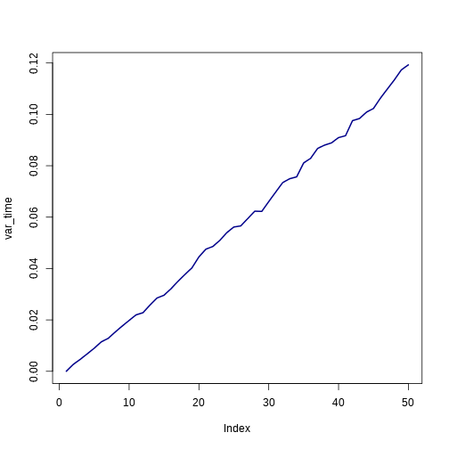
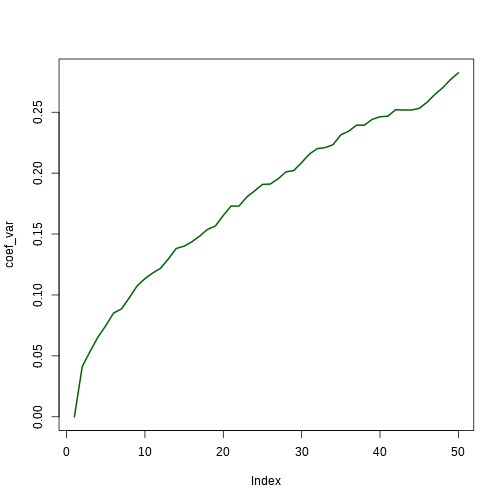

Vectorisation et tests
=======================
author: Timothée Poisot

Dans l'épisode précédent
=======================

1. Comment écrire une fonction
2. L'importance de bien penser à son algorithme

Solution de l'exercice
=======================

On génére N points positionnés *au hasard* dans le rectangle ou les deux cercles sont inscrits

On compte combien de points sont dans au moins un cercle (U) et combien sont dans les deux (D)

L'aire relative de la surface ou les cercles se recouvrent est U/D

Version R: `advanced/seance1_cercles.r`

Programme de la séance
=======================

1. Les tests
2. La vectorisation
3. Dynamiques écologiques neutres

Les tests
=======================

Principe général: **si** une condition, **alors** une instruction (**sinon**, autre chose)

Par exemple

```{}
pour tous les nombres i entre et 10
   si i est pair
      afficher i
   sinon
      afficher i + 1
```

Les tests
=======================


```r

pair = function(x) (x%%2) == 0

for(i in c(1:10))
{
   if(pair(i))
   {
      print(i)
   } else {
      print(i+1)
   }
}
```

```
[1] 2
[1] 2
[1] 4
[1] 4
[1] 6
[1] 6
[1] 8
[1] 8
[1] 10
[1] 10
```


Pour faire court en R
=======================


```r
a = 2
b = ifelse(a<3, 0, 1)
b
```

```
[1] 0
```


Le type booléen
=======================

Prend deux valeurs: `vrai` et `faux`

Dans R: `TRUE`, `FALSE`, `T`, `F`, *mais aussi* `1`, `0`  

Par exemple:


```r
a = 2
a == 2
```

```
[1] TRUE
```

```r
a+3 > 3
```

```
[1] TRUE
```

```r
(a+1 > 3) + 1
```

```
[1] 1
```


Comparaisons: *et* logique
=======================


```r
TRUE & TRUE
```

```
[1] TRUE
```

```r
TRUE & FALSE
```

```
[1] FALSE
```

```r
FALSE & FALSE
```

```
[1] FALSE
```


Comparaisons: *ou* logique
=======================


```r
TRUE | TRUE
```

```
[1] TRUE
```

```r
TRUE | FALSE
```

```
[1] TRUE
```

```r
FALSE | FALSE
```

```
[1] FALSE
```


Comparaisons: précédence
=======================


```r
TRUE | FALSE & TRUE
```

```
[1] TRUE
```

```r
TRUE | ( FALSE & TRUE )
```

```
[1] TRUE
```

```r
(TRUE | FALSE) & TRUE
```

```
[1] TRUE
```


Comparaisons
=======================


```r
TRUE + TRUE
```

```
[1] 2
```

```r
TRUE * FALSE
```

```
[1] 0
```

```r
TRUE + FALSE
```

```
[1] 1
```


Comparaisons: *ou exclusif*
=======================


```r
xor(TRUE, FALSE)
```

```
[1] TRUE
```

```r
xor(FALSE, FALSE)
```

```
[1] FALSE
```

```r
xor(TRUE, TRUE)
```

```
[1] FALSE
```


Comparaisons: *non*
=======================


```r
TRUE
```

```
[1] TRUE
```

```r
!TRUE
```

```
[1] FALSE
```

```r
!FALSE
```

```
[1] TRUE
```


Exercice - programmer le *ou exclusif*
=======================

**Rappel**: (prédicat 1 *ou* prédicat 2) *mais pas* (prédicat 1 *et* prédicat 2)

Exercice - en R
=======================


```r
ouExcl = function(pr1, pr2) (!(pr1 & pr2))&(pr1 | pr2)
xor(T, F)
```

```
[1] TRUE
```

```r
ouExcl(T, F)
```

```
[1] TRUE
```

```r
xor(T, T)
```

```
[1] FALSE
```

```r
ouExcl(T, T)
```

```
[1] FALSE
```


Rappel - vecteur
=======================

Dans R, un vecteur est un object avec plusieurs éléments, numérotés de `1` à `length(objet)`

On accède à l'élément à la position `i` avec `objet[i]`


```r
a = seq(from=0, to=3, length=9)
print(a[1])
```

```
[1] 0
```

```r
print(a[3])
```

```
[1] 0.75
```


Rappel - matrices
=======================

Une matrice a deux dimensions, allant de `1` à `nrow(matrice)` et `ncol(matrice)`

On accède à la ligne `i` par `matrice[i,]`, à la colonne `j` par `matrice[j]`, et à l'élément `i,j` par `matrice[i,j]`

Rappel - matrices
=======================


```r
b = matrix(c(1:4),nrow=2)
print(b)
```

```
     [,1] [,2]
[1,]    1    3
[2,]    2    4
```

```r
print(b[1,2])
```

```
[1] 3
```

```r
print(b[2,1])
```

```
[1] 2
```


La vectorisation
=======================

1. Permet d'accéder rapidement a des éléments de vecteurs
2. Automatise le traitement des vecteurs
3. **Central** pour écrire du code `R` efficace

La vectorisation - accès
=======================


```r
ve = c(1,2,3,5,8,13)
ve[1]
```

```
[1] 1
```

```r
ve[c(1,3,4)]
```

```
[1] 1 3 5
```

```r
ve <= 5
```

```
[1]  TRUE  TRUE  TRUE  TRUE FALSE FALSE
```

```r
ve[ve <= 5]
```

```
[1] 1 2 3 5
```


La vectorisation - opérations
=======================


```r
ve = c(1:3)
vpl2 = c()
for(i in c(1:length(ve))) vpl2[i] = ve[i]+2
vpl2
```

```
[1] 3 4 5
```

```r

ve+2
```

```
[1] 3 4 5
```


La vectorisation - répétitions
=======================


```r
replicate(4, 10)
```

```
[1] 10 10 10 10
```


Mouvement brownien
=======================

(*en résumé*) une mouvement dans lequel on se déplace aléatoirement à partir de son état actuale (*random walk*)

$$x_{t+1} = x_{t} + \mathcal{N}(0, \sigma)$$

Mouvement brownien
=======================


```r
brownian = function(x0=0, steps=10)
{
   x = c(x0)
   for(i in c(2:steps))
   {
      x[i] = x[(i-1)] + rnorm(1, 0, 0.05)
   }
   return(x)
}

brownian(steps=4)
```

```
[1]  0.000000 -0.008111  0.010608 -0.007255
```


Mouvement brownien
=======================


```r
for(i in c(1:5))
{
   print(brownian(steps=3))
}
```

```
[1] 0.00000 0.03095 0.04652
[1]  0.000000 -0.015567  0.006057
[1] 0.000000 0.004555 0.062313
[1] 0.000000 0.002926 0.043918
[1] 0.00000 0.02746 0.09229
```


Mouvement brownien
=======================


```r
replicate(5, brownian(steps=3))
```

```
          [,1]      [,2]      [,3]     [,4]      [,5]
[1,]  0.000000  0.000000  0.000000  0.00000  0.000000
[2,] -0.035466 -0.009045 -0.007019 -0.03014 -0.050364
[3,] -0.006589 -0.047416  0.003134 -0.09909 -0.005664
```


Mouvement brownien
=======================


```r
walk = replicate(300, brownian(steps=50))

var_time = apply(walk, 1, var)

print(head(var_time))
```

```
[1] 0.000000 0.002685 0.004647 0.006779 0.008967 0.011421
```


Mouvement brownien
=======================

 


`apply`
=======================

```{}
apply(matrice, DIM, FUN)
```

- `DIM`: `1` pour les lignes, `2` pour les colonnes
- `FUN`: toute fonction prennant un vecteur comme argument

`apply` - définition en-ligne
=======================


```r
coef_var = apply(walk, 1, function(x) mean(abs(x)))
plot(coef_var, type='l', lwd=2, col='darkgreen')
```

 


Exercice - dynamiques écologiques neutres
=======================

1. On dispose d'un *pool* régional de `J` espèces, identifiées par leur index (de `1` à `J`).
2. Sur une île, on a `K` individus pris au hasard parmis les `J` espèces.
3. À chaque pas de temps, chaque individu a une probabilité `m` de mourir.
4. La recolonisation est immédiate, soit par natalité (probabilité `n`), soit par immigration
5. Toutes les espèces ont la même chance d'immigrer
6. Tous les individus ont la même chance de se reproduire
