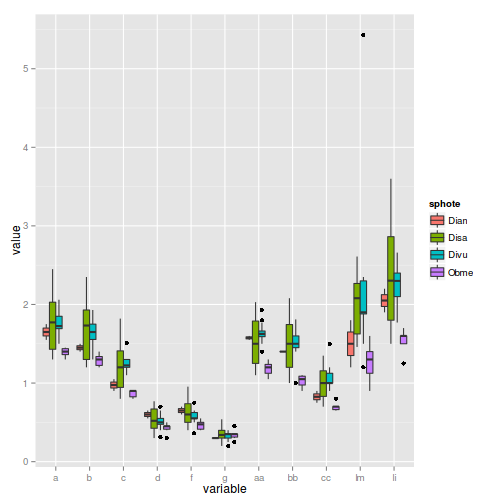
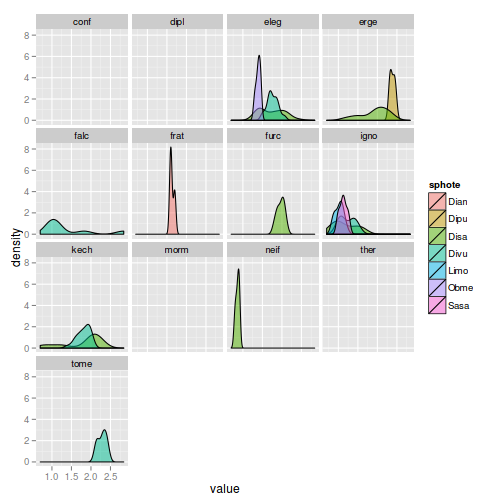
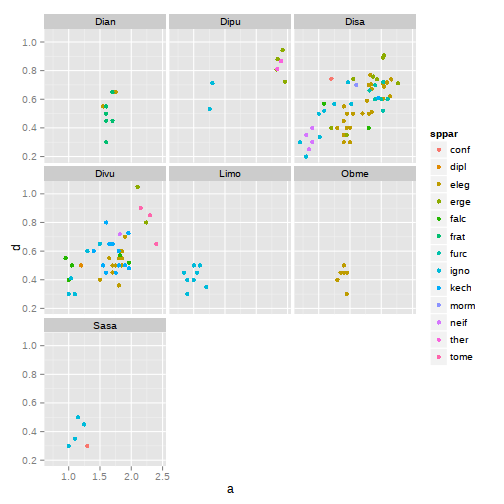

Stratégies pour l'analyse de données
=======
author: Timothée Poisot

Dans la dernière séance
=======

- Ne pas utiliser de boucles `for`
- Utiliser les raccourcis le plus possible

Objectifs de la séance
=======

1. Concevoir une stratégie d'analyse de données
2. `split`-`apply`-`combine`
3. Les *packages* `plyr` et `reshape`
4. Les graphiques avec `ggplot2`

Les données "complexes"
=====

1. De grande taille (*relativement aux statistiques classiques*)
2. Multi-factorielles
3. Incomplètes

Fonctions de base dans R
=====

- `lapply`, `tapply`, `aggregate`, `sapply`, ...
- **Problème**: Pas de consistence dans
   1. les noms
   2. le comportement
   3. les entrées / sorties

Un exemple
=======

- 147 individus de différentes espèces de parasites de poissons, sur différents hôtes
- une dizaine de mesures morphométriques
- certaines données sont manquantes
- toutes les combinaisons de facteurs n'ont pas le même nombre d'observations

Pour récupérer les données: `http://dx.doi.org/10.6084/m9.figshare.97320`

La question
======

1. La morphologie des différentes espèces est-elle la même?
2. La morphologie d'une même espèce sur ses différents hôtes?

Pour la réponse: Timothée Poisot, Yves Desdevises (2010) Putative speciation
events in *Lamellodiscus* (Monogenea: Diplectanidae) assessed by a morphometric
approach. *Biological Journal of the Linnean Society* 99 (3) 559-569.

Lecture des données
======


```r
lam = read.table('http://files.figshare.com/143154/lamellodiscus.txt',sep='\t',h=TRUE,dec='.')
head(lam)
```

```
  sphote sppar      para    a    b    c    d    f    g   aa   bb   cc   lm
1   Divu  eleg elegDivu1 2.06 1.93   NA   NA   NA   NA 1.93 1.81 1.16 5.43
2   Divu  eleg elegDivu2 1.93 1.82 1.51 0.41 0.57 0.20 1.77 1.67 1.20 2.35
3   Divu  eleg elegDivu2 1.67 1.56 1.20 0.31 0.36 0.26 1.56 1.51 0.94 1.88
4   Disa  eleg elegDisa1 1.46 1.41 1.04 0.47 0.67 0.31 1.25 1.20 0.83 1.46
5   Disa  eleg elegDisa1 1.30 1.25 0.94 0.36 0.52 0.31 1.14 1.09 0.78   NA
6   Disa  eleg elegDisa1 1.41 1.35 0.99 0.36 0.57 0.36 1.25 1.20 0.83 2.08
    li
1 2.66
2 2.66
3 1.77
4 2.19
5 2.03
6 2.55
```


Préparer les données
=====


```r
library(reshape2)
lam = melt(lam, na.rm=TRUE)
head(lam)
```

```
  sphote sppar      para variable value
1   Divu  eleg elegDivu1        a  2.06
2   Divu  eleg elegDivu2        a  1.93
3   Divu  eleg elegDivu2        a  1.67
4   Disa  eleg elegDisa1        a  1.46
5   Disa  eleg elegDisa1        a  1.30
6   Disa  eleg elegDisa1        a  1.41
```


Taille d'échantillon
=====


```r
acast(lam, sppar ~ sphote ~ variable, length)
```

```
, , a

     Dian Dipu Disa Divu Limo Obme Sasa
conf    0    0    1    0    0    0    1
dipl    0    0    0    2    0    0    0
eleg    2    0   35   16    0    6    0
erge    0    4   12    2    0    0    0
falc    0    0    2    7    0    0    0
frat    6    0    0    0    0    0    0
furc    0    0    7    0    0    0    0
igno    0    2   17    8   10    0    4
kech    0    0    7   23    0    0    0
morm    0    0    1    0    0    0    0
neif    0    0    4    1    0    0    0
ther    0    2    0    0    0    0    0
tome    0    0    0    3    0    0    0

, , b

     Dian Dipu Disa Divu Limo Obme Sasa
conf    0    0    1    0    0    0    1
dipl    0    0    0    2    0    0    0
eleg    2    0   35   15    0    6    0
erge    0    4   12    2    0    0    0
falc    0    0    2    6    0    0    0
frat    6    0    0    0    0    0    0
furc    0    0    7    0    0    0    0
igno    0    2   16    7   10    0    4
kech    0    0    6   22    0    0    0
morm    0    0    1    0    0    0    0
neif    0    0    4    1    0    0    0
ther    0    2    0    0    0    0    0
tome    0    0    0    3    0    0    0

, , c

     Dian Dipu Disa Divu Limo Obme Sasa
conf    0    0    1    0    0    0    1
dipl    0    0    0    2    0    0    0
eleg    2    0   35   14    0    6    0
erge    0    4   12    2    0    0    0
falc    0    0    2    5    0    0    0
frat    6    0    0    0    0    0    0
furc    0    0    7    0    0    0    0
igno    0    2   15    7   10    0    4
kech    0    0    6   19    0    0    0
morm    0    0    1    0    0    0    0
neif    0    0    4    1    0    0    0
ther    0    2    0    0    0    0    0
tome    0    0    0    3    0    0    0

, , d

     Dian Dipu Disa Divu Limo Obme Sasa
conf    0    0    1    0    0    0    1
dipl    0    0    0    2    0    0    0
eleg    2    0   35   15    0    6    0
erge    0    4   12    2    0    0    0
falc    0    0    2    5    0    0    0
frat    6    0    0    0    0    0    0
furc    0    0    7    0    0    0    0
igno    0    2   15    7   10    0    4
kech    0    0    6   18    0    0    0
morm    0    0    1    0    0    0    0
neif    0    0    4    1    0    0    0
ther    0    2    0    0    0    0    0
tome    0    0    0    3    0    0    0

, , f

     Dian Dipu Disa Divu Limo Obme Sasa
conf    0    0    1    0    0    0    1
dipl    0    0    0    2    0    0    0
eleg    2    0   35   15    0    6    0
erge    0    4   12    2    0    0    0
falc    0    0    2    6    0    0    0
frat    6    0    0    0    0    0    0
furc    0    0    7    0    0    0    0
igno    0    2   15    7   10    0    4
kech    0    0    6   22    0    0    0
morm    0    0    1    0    0    0    0
neif    0    0    4    1    0    0    0
ther    0    2    0    0    0    0    0
tome    0    0    0    3    0    0    0

, , g

     Dian Dipu Disa Divu Limo Obme Sasa
conf    0    0    1    0    0    0    1
dipl    0    0    0    2    0    0    0
eleg    2    0   34   15    0    6    0
erge    0    4   12    2    0    0    0
falc    0    0    2    5    0    0    0
frat    6    0    0    0    0    0    0
furc    0    0    7    0    0    0    0
igno    0    2   15    7   10    0    4
kech    0    0    6   17    0    0    0
morm    0    0    1    0    0    0    0
neif    0    0    4    1    0    0    0
ther    0    2    0    0    0    0    0
tome    0    0    0    3    0    0    0

, , aa

     Dian Dipu Disa Divu Limo Obme Sasa
conf    0    0    1    0    0    0    1
dipl    0    0    0    2    0    0    0
eleg    2    0   35   16    0    6    0
erge    0    4   13    2    0    0    0
falc    0    0    2    7    0    0    0
frat    6    0    0    0    0    0    0
furc    0    0    7    0    0    0    0
igno    0    2   17    8   10    0    4
kech    0    0    7   23    0    0    0
morm    0    0    1    0    0    0    0
neif    0    0    4    1    0    0    0
ther    0    2    0    0    0    0    0
tome    0    0    0    3    0    0    0

, , bb

     Dian Dipu Disa Divu Limo Obme Sasa
conf    0    0    1    0    0    0    1
dipl    0    0    0    2    0    0    0
eleg    2    0   35   15    0    6    0
erge    0    4   13    2    0    0    0
falc    0    0    2    6    0    0    0
frat    6    0    0    0    0    0    0
furc    0    0    7    0    0    0    0
igno    0    2   16    8   10    0    4
kech    0    0    6   22    0    0    0
morm    0    0    1    0    0    0    0
neif    0    0    4    1    0    0    0
ther    0    2    0    0    0    0    0
tome    0    0    0    3    0    0    0

, , cc

     Dian Dipu Disa Divu Limo Obme Sasa
conf    0    0    1    0    0    0    1
dipl    0    0    0    2    0    0    0
eleg    2    0   35   15    0    6    0
erge    0    4   13    2    0    0    0
falc    0    0    2    6    0    0    0
frat    6    0    0    0    0    0    0
furc    0    0    7    0    0    0    0
igno    0    2   16    8   10    0    4
kech    0    0    6   22    0    0    0
morm    0    0    1    0    0    0    0
neif    0    0    4    1    0    0    0
ther    0    2    0    0    0    0    0
tome    0    0    0    3    0    0    0

, , lm

     Dian Dipu Disa Divu Limo Obme Sasa
conf    0    0    1    0    0    0    1
dipl    0    0    0    2    0    0    0
eleg    2    0   34   13    0    6    0
erge    0    4   13    2    0    0    0
falc    0    0    2    5    0    0    0
frat    6    0    0    0    0    0    0
furc    0    0    7    0    0    0    0
igno    0    2   18    8   10    0    3
kech    0    0    7   22    0    0    0
morm    0    0    1    0    0    0    0
neif    0    0    4    1    0    0    0
ther    0    2    0    0    0    0    0
tome    0    0    0    3    0    0    0

, , li

     Dian Dipu Disa Divu Limo Obme Sasa
conf    0    0    1    0    0    0    1
dipl    0    0    0    2    0    0    0
eleg    2    0   35   13    0    5    0
erge    0    4   13    2    0    0    0
falc    0    0    2    5    0    0    0
frat    6    0    0    0    0    0    0
furc    0    0    7    0    0    0    0
igno    0    2   18    6   10    0    4
kech    0    0    7   22    0    0    0
morm    0    0    1    0    0    0    0
neif    0    0    4    1    0    0    0
ther    0    2    0    0    0    0    0
tome    0    0    0    3    0    0    0
```


Limitation
=====

> If the combination of variables you supply does not uniquely identify one row in the original data set, you will need to supply an aggregating function, fun.aggregate. This function should take a vector of numbers and return a single summary statistic.

**Solution**: la librairie `plyr`

Stratégie d'analyse
=====

1. `split`: diviser les données en ensembles (*pieces*) sur lesquels on travaille
2. `apply`: appliquer la fonction de traitement à chaque *piece*
3. `combine`: "re-coller" les objets dans un objet final

Une adresse: [http://plyr.had.co.nz/](http://plyr.had.co.nz/)

Fonction de traitement
=====

1. Prend une *piece* comme argument
2. Applique la mesure, statistique, *etc*.
3. Renvoie un objet (idéalement) de la même nature que la *piece*

**Important:** La fonction de traitement doit *toujours* renvoyer un objet du même type (rappel séance 1: prédictibilité)

plyr
======

Nommage des fonctions de `plyr`: `**ply()`

- `d`: `data.frame`
- `a`: `array` (vecteur)
- `l`: `list`
- `_`: *discard* (only for the second letter)

**Exemple:** `dlply` prend un `data.frame` en entrée, renvoie une `list`

plyr
======


```r
library(plyr)
head(ddply(lam, sphote~sppar~variable, function(x) mean(x$value)))
```

```
  sphote sppar variable    V1
1   Dian  eleg        a 1.650
2   Dian  eleg        b 1.450
3   Dian  eleg        c 0.975
4   Dian  eleg        d 0.600
5   Dian  eleg        f 0.650
6   Dian  eleg        g 0.300
```


Une note importante
======

Les `data.frame` sont des `list` d'`array`. On peut donc les utiliser dans `l*ply()`.

Les `data.frame` sont des `array` a deux dimensions. On peut donc les utiliser dans `a*ply()`.

Procédure
======

1. Définir le type entrée/sortie
2. Définir la fonction de traitement
3. Appeller la fonction `**ply` qui correspond

Exemple
=====

On a des données spatiales hétérogènes


```r
n = 100
x = round(runif(4),1)
y = round(runif(4),1)
pop = data.frame(
   X = sample(x, n, replace=T),
   Y = sample(y, n, replace=T),
   N = rlnorm(n, 2.0)
)
```


On veut standardiser (`scale`) les données *par site*, pour avoir des données de moyenne 0, d'écart-type 1.

Approche R "classique"
======


```r
head(aggregate(pop$N, list(X=pop$X, Y=pop$Y), scale))
```

```
    X   Y
1 0.4 0.2
2 0.5 0.2
3 0.4 0.4
4 0.5 0.4
5 0.4 0.6
6 0.5 0.6
                                                                                                                                                                             x
1                                                                                                    0.21010, 0.55610, 0.85627, 1.11282, -1.69552, -0.05247, -1.30301, 0.31570
2 -0.2058, 1.0376, 0.9951, -0.1628, -0.9595, 1.3184, -0.1921, -0.5854, -0.4897, 1.5700, -0.7425, 0.1498, -0.4433, -0.2119, 2.7198, -0.7093, -0.6463, -0.8098, -0.8216, -0.8108
3                                                              -0.2300, 1.1623, -0.5926, -1.0494, -0.3619, -0.1212, 1.3995, -0.1174, -1.1229, -0.6546, -1.1392, 1.2703, 1.5572
4                                                                                                 -0.2656, 0.9081, -0.6029, -0.8863, -0.1490, 0.2365, 2.1997, -0.6948, -0.7458
5                                                                                         0.9751, -0.4163, -1.1184, 1.7173, -0.3482, 0.0346, 1.2054, -0.4238, -1.3602, -0.2656
6                                                                                         0.01273, -0.70247, -0.25890, 1.00875, 0.38354, -0.04087, 1.90161, -1.12250, -1.18188
```


Approche plyr - scale
======


```r
head(ddply(pop, .(X, Y), function(df) scale(df$N)))
```

```
    X   Y        1
1 0.4 0.2  0.21010
2 0.4 0.2  0.55610
3 0.4 0.2  0.85627
4 0.4 0.2  1.11282
5 0.4 0.2 -1.69552
6 0.4 0.2 -0.05247
```


Approche plyr - nombre d'échantillons
======


```r
out = ddply(pop, .(X, Y), function(df) length(df$N))
head(out)
```

```
    X   Y V1
1 0.4 0.2  8
2 0.4 0.4 13
3 0.4 0.6 10
4 0.4 0.7 20
5 0.5 0.2 20
6 0.5 0.4  9
```


Approche plyr - syntaxe simplifiée
======


```r
out = ddply(pop, Y~X, nrow)
head(out)
```

```
    Y   X V1
1 0.2 0.4  8
2 0.2 0.5 20
3 0.4 0.4 13
4 0.4 0.5  9
5 0.6 0.4 10
6 0.6 0.5  9
```


Approche plyr - vers une matrice
======


```r
out = daply(pop, Y~X, nrow)
out
```

```
     X
Y     0.4 0.5
  0.2   8  20
  0.4  13   9
  0.6  10   9
  0.7  20  11
```


Approche plyr - vers une liste
======


```r
out = dlply(pop, Y~X, nrow)
head(out)
```

```
$`0.2.0.4`
[1] 8

$`0.2.0.5`
[1] 20

$`0.4.0.4`
[1] 13

$`0.4.0.5`
[1] 9

$`0.6.0.4`
[1] 10

$`0.6.0.5`
[1] 9
```


Retour aux données
======


```r
all_means = ddply(lam, sphote ~ sppar ~ variable, summarize, mean = mean(value), sd = sd(value), n = length(value))
head(all_means)
```

```
  sphote sppar variable  mean      sd n
1   Dian  eleg        a 1.650 0.14142 2
2   Dian  eleg        b 1.450 0.07071 2
3   Dian  eleg        c 0.975 0.10607 2
4   Dian  eleg        d 0.600 0.07071 2
5   Dian  eleg        f 0.650 0.07071 2
6   Dian  eleg        g 0.300 0.00000 2
```


La foncton summarize
=====

La fonction `summarize` permet de résumer et de donner des noms aux statistiques:

```
summarize, mean_X = mean(X), mean_Y = mean(Y), sample_X = nrow(X)
```

Utilisation de subset
=====


```r
all_eleg = ddply(subset(lam, sppar=='eleg'), sphote ~ variable, summarize, mean = round(mean(value), 2), sd = round(sd(value), 2), n = length(value))
head(all_eleg)
```

```
  sphote variable mean   sd n
1   Dian        a 1.65 0.14 2
2   Dian        b 1.45 0.07 2
3   Dian        c 0.98 0.11 2
4   Dian        d 0.60 0.07 2
5   Dian        f 0.65 0.07 2
6   Dian        g 0.30 0.00 2
```

Remettre les données en forme
=====


```r
dcast(all_eleg, sphote ~ variable, value.var = "mean")
```

```
  sphote    a    b    c    d    f    g   aa   bb   cc   lm   li
1   Dian 1.65 1.45 0.98 0.60 0.65 0.30 1.58 1.40 0.82 1.50 2.05
2   Disa 1.74 1.66 1.19 0.53 0.63 0.36 1.53 1.48 1.00 2.01 2.34
3   Divu 1.76 1.64 1.24 0.51 0.57 0.33 1.64 1.50 1.07 2.20 2.27
4   Obme 1.39 1.29 0.87 0.42 0.47 0.34 1.18 1.03 0.70 1.27 1.53
```

Synthèse
=====

1. Lire les données
2. Les mettre en forme avec `reshape2`
3. Les traiter avec `plyr`
4. Éventuellement, les formatter avec `reshape2`

Visualisation
=====

La librairie `ggplot2` permet de visualiser facilement des `data.frame` (au format retourné par `melt`)


```r
library(ggplot2)
```


Principe de ggplot2
=====

*Grammaire graphique*

1. Données
2. Esthétiques
3. Visualisation

**Étape obligée:** [http://docs.ggplot2.org/current/](http://docs.ggplot2.org/current/)

Exemple
=====


```r
ggplot(subset(lam, lam$sppar=='eleg'), aes(x=variable, y=value, fill=sphote)) + geom_boxplot()
```

 


Exemple
=====


```r
ggplot(droplevels(subset(lam, lam$variable=='a')), aes(x=value, fill=sphote)) + geom_density(alpha=0.5) + facet_wrap(~sppar)
```

 


Exemple
=====


```r
wvar = dcast(lam, sppar * sphote * para ~ variable, value.var = c("value"), mean)
ggplot(wvar, aes(x=a, y=d, colour=sppar)) + geom_point() + facet_wrap(~sphote)
```

 

